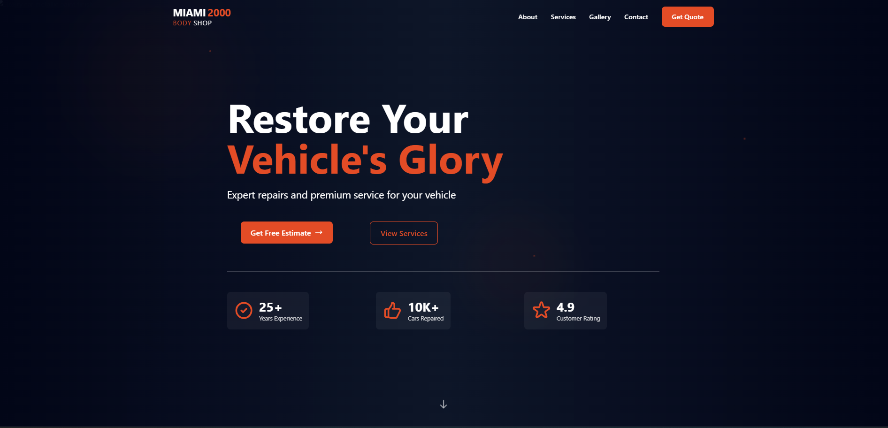

# Miami 2000 Body Shop



## 🚗 Live Demo

[View the live site on Netlify](https://miami2000.netlify.app/)

## 📝 Description

Miami 2000 Body Shop website is designed to showcase the services offered by the auto body repair shop, allowing customers to view completed work, learn about services, and request quotes. The site features a modern design with vibrant colors and smooth animations to create an engaging user experience.

## ✨ Features

- **Responsive Design**: Optimized for all screen sizes from mobile to desktop
- **Modern UI**: Sleek interface with animations and interactive elements
- **Multi-page Layout**: Home, About, Services, Gallery, and Contact pages
- **Image Gallery**: Showcasing completed auto body work with a modal view
- **Service Cards**: Flippable cards that showcase services with details
- **Contact Form**: Form for customer inquiries with validation
- **AOS Animations**: Scroll-triggered animations for enhanced user experience
- **SEO Optimized**: Structured for better search engine visibility
- **Server-Side Rendering**: Angular Universal for improved performance and SEO

## 🛠️ Technologies

- **Frontend**: Angular 19
- **Styling**: TailwindCSS
- **Animation**: AOS (Animate On Scroll)
- **Form Handling**: Angular Reactive Forms
- **Deployment**: Netlify
- **SSR**: Angular Universal

## 🚀 Getting Started

### Prerequisites

- Node.js (v18+)
- npm or yarn

### Installation

1. Clone this repository:
```bash
git clone https://github.com/anicabarrios/Miami-2000
cd miami-2000
```

2. Install dependencies:
```bash
npm install
```

3. Start the development server:
```bash
npm start
```

4. Open your browser and navigate to `http://localhost:4200/`

## 📂 Project Structure

```
src/
├── app/
│   ├── core/           # Core functionality (services, etc.)
│   ├── features/       # Feature components (header, footer, etc.)
│   ├── pages/          # Page components (home, about, etc.)
│   ├── shared/         # Shared components (buttons, cards, etc.)
│   ├── app.component.* # App root component
│   └── app.config.*    # App configuration
├── assets/             # Static assets (images, etc.)
└── styles.css          # Global styles
```

## 📱 Responsive Design

The website is fully responsive with optimized layouts for:
- Mobile devices
- Tablets
- Desktops
- Large screens

## 🔧 Building for Production

```bash
npm run build
```

The build artifacts will be stored in the `dist/` directory.

## 🌐 Deployment

This project is deployed on Netlify with continuous deployment from the main branch.

## 📄 License

This project is licensed under the MIT License - see the LICENSE file for details.

## 👨‍💻 Author

Created by Anica Barrios

---

© 2025 Miami 2000  Body Shop